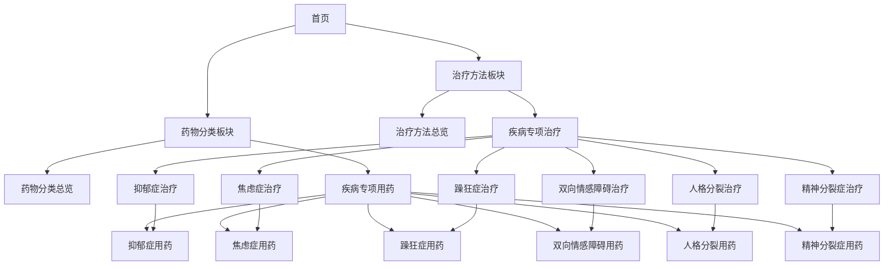

## 1. Product Overview

本项目旨在为现有的GMI精神疾病指南网站添加两个重要的功能板块：治疗方法板块和药物分类&作用板块。这两个板块将为用户提供更全面的精神健康治疗信息，涵盖项目现有的6种精神疾病，提升网站的实用价值和专业性。

## 2. Core Features

### 2.1 Feature Module

我们的GMI扩展需求包含以下主要页面：
1. **治疗方法总览页面**：治疗方法分类导航、各疾病治疗方法对比表、治疗效果评估
2. **疾病专项治疗页面**：针对6种精神疾病的具体治疗方案、治疗流程、注意事项
3. **药物分类总览页面**：药物分类体系、作用机制介绍、使用指南
4. **疾病专项用药页面**：针对6种精神疾病的药物治疗方案、用药指导、副作用说明

### 2.2 Page Details

| Page Name | Module Name | Feature description |
|-----------|-------------|---------------------|
| 治疗方法总览页面 | 治疗分类导航 | 展示心理治疗、药物治疗、物理治疗、生活方式干预等主要治疗类别 |
| 治疗方法总览页面 | 疾病治疗对比 | 提供6种精神疾病的治疗方法对比表格，便于用户了解不同疾病的治疗差异 |
| 治疗方法总览页面 | 治疗效果评估 | 介绍各种治疗方法的有效性、适用人群、治疗周期等信息 |
| 疾病专项治疗页面 | 抑郁症治疗方案 | 详细介绍抑郁症的心理治疗、药物治疗、物理治疗等具体方案 |
| 疾病专项治疗页面 | 焦虑症治疗方案 | 详细介绍焦虑症的认知行为疗法、暴露疗法、药物治疗等方案 |
| 疾病专项治疗页面 | 躁狂症治疗方案 | 详细介绍躁狂症的情绪稳定剂治疗、心理干预、危机管理等方案 |
| 疾病专项治疗页面 | 双向情感障碍治疗方案 | 详细介绍双相障碍的长期治疗策略、情绪监测、复发预防等 |
| 疾病专项治疗页面 | 人格分裂治疗方案 | 详细介绍解离性身份障碍的整合治疗、创伤处理、支持系统建立 |
| 疾病专项治疗页面 | 精神分裂症治疗方案 | 详细介绍精神分裂症的抗精神病药物治疗、康复训练、社会支持等 |
| 药物分类总览页面 | 药物分类体系 | 展示抗抑郁药、抗焦虑药、情绪稳定剂、抗精神病药等主要分类 |
| 药物分类总览页面 | 作用机制介绍 | 解释各类药物的作用原理、神经递质影响、药理学基础 |
| 药物分类总览页面 | 用药安全指南 | 提供用药注意事项、副作用监测、药物相互作用等安全信息 |
| 疾病专项用药页面 | 抑郁症用药指导 | 详细介绍SSRIs、SNRIs、三环类等抗抑郁药的使用方法 |
| 疾病专项用药页面 | 焦虑症用药指导 | 详细介绍苯二氮卓类、SSRI类等抗焦虑药物的使用指南 |
| 疾病专项用药页面 | 躁狂症用药指导 | 详细介绍锂盐、抗癫痫药等情绪稳定剂的使用方法 |
| 疾病专项用药页面 | 双向情感障碍用药指导 | 详细介绍双相障碍的复合用药方案、剂量调整、监测要点 |
| 疾病专项用药页面 | 人格分裂用药指导 | 详细介绍解离性障碍的辅助用药、症状管理药物使用 |
| 疾病专项用药页面 | 精神分裂症用药指导 | 详细介绍典型和非典型抗精神病药物的使用指南 |

## 3. Core Process

**用户浏览治疗信息流程：**
用户从首页进入治疗方法板块，可以选择查看治疗方法总览了解各种治疗类别，或直接进入特定疾病的治疗页面查看详细方案。在治疗页面中，用户可以进一步点击链接查看相关的药物治疗信息。

**用户查询药物信息流程：**
用户从首页进入药物分类板块，可以先了解药物分类体系和作用机制，然后根据具体疾病查看专项用药指导。每个疾病的用药页面都会提供详细的药物信息和安全指南。

## 4. User Interface Design

### 4.1 Design Style

- **主色调**：保持与现有网站一致的Material Design风格，使用蓝色(#1976D2)作为主色，绿色(#4CAF50)作为辅助色
- **按钮样式**：圆角按钮，与MkDocs Material主题保持一致
- **字体**：中文使用思源黑体，英文使用Roboto，标题使用18-24px，正文使用14-16px
- **布局风格**：卡片式布局，清晰的层级结构，响应式设计
- **图标样式**：使用Material Icons，简洁明了的医疗相关图标

### 4.2 Page Design Overview

| Page Name | Module Name | UI Elements |
|-----------|-------------|-------------|
| 治疗方法总览页面 | 治疗分类导航 | 使用卡片式布局展示4大治疗类别，每个卡片包含图标、标题和简短描述，采用网格布局 |
| 治疗方法总览页面 | 疾病治疗对比 | 使用响应式表格展示6种疾病的治疗方法对比，支持横向滚动，表头固定 |
| 疾病专项治疗页面 | 治疗方案详情 | 使用手风琴式折叠面板展示不同治疗方法，每个面板包含详细说明和注意事项 |
| 药物分类总览页面 | 药物分类体系 | 使用树状结构或分层卡片展示药物分类，支持展开收起功能 |
| 药物分类总览页面 | 作用机制介绍 | 使用图文结合的方式展示药物作用机制，包含简化的神经递质示意图 |
| 疾病专项用药页面 | 用药指导详情 | 使用标签页切换不同药物类别，每个标签页内使用列表展示具体药物信息 |

### 4.3 Responsiveness

网站采用移动优先的响应式设计，确保在桌面端、平板端和移动端都有良好的用户体验。表格在移动端会转换为卡片式布局，导航菜单支持折叠显示。