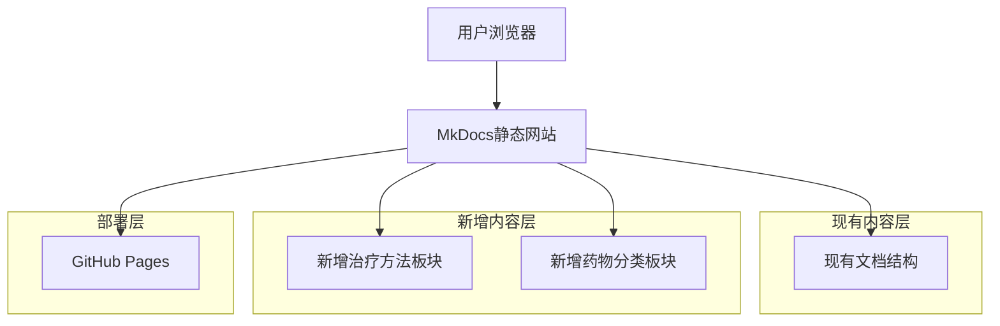

## 1.Architecture design



## 2.Technology Description

- Frontend: MkDocs + Material Theme + Markdown
- Backend: 无需后端，纯静态网站
- 部署: GitHub Pages + GitHub Actions

## 3.Route definitions

| Route | Purpose |
|-------|----------|
| /treatment-methods/ | 治疗方法总览页面，展示各种治疗方法分类和对比 |
| /treatment-methods/depression/ | 抑郁症专项治疗方案页面 |
| /treatment-methods/anxiety/ | 焦虑症专项治疗方案页面 |
| /treatment-methods/mania/ | 躁狂症专项治疗方案页面 |
| /treatment-methods/bipolar/ | 双向情感障碍专项治疗方案页面 |
| /treatment-methods/personality-disorder/ | 人格分裂专项治疗方案页面 |
| /treatment-methods/schizophrenia/ | 精神分裂症专项治疗方案页面 |
| /medications/ | 药物分类总览页面，展示药物分类体系和作用机制 |
| /medications/depression/ | 抑郁症专项用药指导页面 |
| /medications/anxiety/ | 焦虑症专项用药指导页面 |
| /medications/mania/ | 躁狂症专项用药指导页面 |
| /medications/bipolar/ | 双向情感障碍专项用药指导页面 |
| /medications/personality-disorder/ | 人格分裂专项用药指导页面 |
| /medications/schizophrenia/ | 精神分裂症专项用药指导页面 |

## 4.文件结构设计

### 4.1 目录结构扩展

```
docs/
├── index.md                    # 现有首页
├── depression.md               # 现有疾病页面
├── anxiety.md
├── mania.md
├── bipolar.md
├── personality_disorder.md
├── schizophrenia.md
├── diagnostic_criteria.md      # 现有诊断标准
├── treatment.md                # 现有治疗资源
├── treatment-methods/          # 新增：治疗方法板块
│   ├── index.md               # 治疗方法总览
│   ├── depression.md          # 抑郁症治疗方案
│   ├── anxiety.md             # 焦虑症治疗方案
│   ├── mania.md               # 躁狂症治疗方案
│   ├── bipolar.md             # 双向情感障碍治疗方案
│   ├── personality_disorder.md # 人格分裂治疗方案
│   └── schizophrenia.md       # 精神分裂症治疗方案
└── medications/               # 新增：药物分类板块
    ├── index.md               # 药物分类总览
    ├── depression.md          # 抑郁症用药指导
    ├── anxiety.md             # 焦虑症用药指导
    ├── mania.md               # 躁狂症用药指导
    ├── bipolar.md             # 双向情感障碍用药指导
    ├── personality_disorder.md # 人格分裂用药指导
    └── schizophrenia.md       # 精神分裂症用药指导
```

### 4.2 MkDocs配置更新

需要更新 `mkdocs.yml` 文件的导航结构：

```yaml
site_name: GMI-精神疾病指南

theme:
    name: material
    features:
      - navigation.tabs
      - navigation.sections
      - navigation.expand
      - navigation.top
      - search.highlight
      - search.share

nav:
  - 首页: index.md
  - 疾病介绍:
    - 抑郁症: depression.md
    - 焦虑症: anxiety.md
    - 躁狂症: mania.md
    - 双向情感障碍: bipolar.md
    - 人格分裂: personality_disorder.md
    - 精神分裂症: schizophrenia.md
  - 治疗方法:
    - 治疗方法总览: treatment-methods/index.md
    - 抑郁症治疗: treatment-methods/depression.md
    - 焦虑症治疗: treatment-methods/anxiety.md
    - 躁狂症治疗: treatment-methods/mania.md
    - 双向情感障碍治疗: treatment-methods/bipolar.md
    - 人格分裂治疗: treatment-methods/personality_disorder.md
    - 精神分裂症治疗: treatment-methods/schizophrenia.md
  - 药物指南:
    - 药物分类总览: medications/index.md
    - 抑郁症用药: medications/depression.md
    - 焦虑症用药: medications/anxiety.md
    - 躁狂症用药: medications/mania.md
    - 双向情感障碍用药: medications/bipolar.md
    - 人格分裂用药: medications/personality_disorder.md
    - 精神分裂症用药: medications/schizophrenia.md
  - 诊断标准: diagnostic_criteria.md
  - 治疗资源: treatment.md

markdown_extensions:
  - admonition
  - pymdownx.details
  - pymdownx.superfences
  - pymdownx.tabbed:
      alternate_style: true
  - tables
  - attr_list
  - md_in_html
```

## 5.内容模板设计

### 5.1 治疗方法页面模板

每个疾病的治疗方法页面应包含以下标准化结构：

```markdown
# [疾病名称]治疗方案

## 治疗方法概述
[疾病治疗的总体介绍]

## 心理治疗
### 认知行为疗法 (CBT)
### 人际关系疗法 (IPT)
### 其他心理治疗方法

## 药物治疗
### 一线药物
### 二线药物
### 联合用药

## 物理治疗
### 电休克疗法 (ECT)
### 经颅磁刺激 (TMS)

## 生活方式干预
### 运动疗法
### 睡眠管理
### 营养支持

## 治疗流程
### 急性期治疗
### 维持期治疗
### 康复期治疗

## 注意事项
### 治疗禁忌
### 副作用监测
### 复发预防

## 相关链接
- [药物治疗详情](../medications/[疾病名称].md)
- [疾病基础信息](../[疾病名称].md)
```

### 5.2 药物指导页面模板

每个疾病的药物指导页面应包含以下标准化结构：

```markdown
# [疾病名称]用药指导

## 用药概述
[疾病用药的总体介绍]

## 一线药物
### [药物分类1]
#### 常用药物
#### 作用机制
#### 用法用量
#### 注意事项

### [药物分类2]
#### 常用药物
#### 作用机制
#### 用法用量
#### 注意事项

## 二线药物
### [药物分类]
#### 适应症
#### 用法用量
#### 监测要点

## 联合用药
### 常见组合
### 相互作用
### 剂量调整

## 特殊人群用药
### 儿童青少年
### 老年人
### 孕妇哺乳期
### 肝肾功能不全

## 副作用管理
### 常见副作用
### 严重不良反应
### 处理方法

## 用药监测
### 疗效评估
### 安全性监测
### 随访要点

## 相关链接
- [治疗方法详情](../treatment-methods/[疾病名称].md)
- [疾病基础信息](../[疾病名称].md)
```

## 6.实施步骤

### 6.1 第一阶段：结构搭建
1. 创建新的目录结构
2. 更新 mkdocs.yml 配置文件
3. 创建各页面的基础框架

### 6.2 第二阶段：内容填充
1. 编写治疗方法总览页面
2. 编写药物分类总览页面
3. 逐个完成6种疾病的治疗方法页面
4. 逐个完成6种疾病的药物指导页面

### 6.3 第三阶段：优化完善
1. 添加页面间的交叉链接
2. 优化页面布局和样式
3. 测试响应式设计
4. 更新首页导航和介绍

### 6.4 第四阶段：部署测试
1. 本地测试完整功能
2. 提交到GitHub仓库
3. 验证GitHub Pages部署
4. 进行用户体验测试